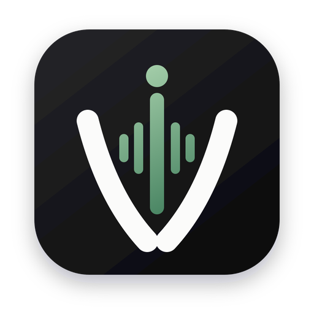

<div align="center">
  

  # Voicetypr

  **Private, open-source voice-to-text dictation for macOS & Windows — local-first, pay once.**

  A fully open alternative to Wispr Flow and superwhisper: press a hotkey, speak, and your words appear at the cursor in any app. Transcription runs on your machine by default; optional AI polish and cloud speech-to-text are strictly opt-in and bring-your-own-key.

  [](https://github.com/moinulmoin/voicetypr/releases)
  [](LICENSE.md)
  [-black)](https://www.apple.com/macos)
  [](https://www.microsoft.com/windows)
  [](https://github.com/moinulmoin/voicetypr/releases)

  [Download](https://github.com/moinulmoin/voicetypr/releases/latest) • [Why Voicetypr](#-why-voicetypr) • [Features](#-features) • [Install](#-installation) • [Build from source](#-building-from-source)
</div>

<!-- TODO(maintainer): add a hero demo GIF here, e.g. docs/demo.gif (record: hotkey → speak → text lands in an app). This is the single highest-impact addition for stars. -->

## 🎯 What is Voicetypr?

Voicetypr is an open-source dictation tool. Bind a global hotkey, speak anywhere, and the text is typed into whatever app has focus — editors, terminals, Slack, browsers, your AI coding assistant. Speech recognition happens **locally by default** (Whisper / Parakeet), so your audio never has to leave your machine. Everything cloud-related — cloud transcription, AI polish — is optional, opt-in, and uses your own API keys.

Available for **macOS (Apple Silicon & Intel) and Windows**. **Pay once, use forever** — no subscription.

## 🔥 Why Voicetypr?

- **Local-first & private** — audio is transcribed on-device by default; nothing is uploaded unless *you* pick a cloud provider. Telemetry is opt-in and off by default.
- **Fully open & auditable** — the entire app is AGPL-3.0. No closed "black box" enhancement blob you have to trust.
- **Cross-platform, today** — signed macOS *and* Windows installers with auto-update, shipping now.
- **Pay once** — a one-time purchase, not a monthly bill.
- **Bring your own everything** — your choice of local model, cloud STT provider, and AI-polish provider (including local LLMs via Ollama / LM Studio).

## ✨ Features

### 🎙️ Instant voice-to-text
- System-wide hotkey to record from anywhere; native trigger engine (combos, hold-to-talk, or tap-to-toggle)
- Text inserted right at the cursor, in any app
- Double-press `Esc` to cancel a recording
- Media auto-pauses while you dictate, then resumes

### 🧠 Transcription — local by default, cloud optional
- **Local:** Whisper (tiny → large) and Parakeet (Apple Neural Engine on macOS); 99+ languages; hardware-accelerated (Metal on macOS, GPU on Windows)
- **Optional cloud STT (BYOK):** Soniox, Deepgram, OpenAI, Groq, Cohere
- Your raw audio stays on-device with local models; it's only sent to a provider if you explicitly choose one

### 🤖 AI polish (optional, bring-your-own-key)
- Clean up dictation without changing your meaning — remove filler, fix grammar and punctuation
- Presets: **Clean Dictation** (default), **Writing**, **Notes**, **Message**, **Code** — plus **Personal Dictation** (no AI, local cleanup only)
- Providers: **OpenAI, Anthropic, Google Gemini, or any OpenAI-compatible endpoint** — including local models via Ollama / LM Studio
- Optionally write the output in a different language than you spoke
- API keys stored securely in the OS keychain

### 📚 Your text rules (always-on, 100% local)
- **Words & Names** — a personal dictionary that also improves recognition accuracy
- **Corrections** — find-and-replace rules applied to every transcription
- **Snippets** — expand spoken phrases into templates
- **Voice commands** — "new line", "period", etc.
- **Per-app rules** — different formatting for different apps

### 🌐 Network sharing & remote transcription
- Run the heavy model on one machine and transcribe from another over your LAN (built-in server + client)

### ⌨️ CLI / agent mode
- Drive Voicetypr from the command line for scripting and agent workflows

### 🔒 Privacy first
- Local transcription by default — raw audio stays on your device
- Telemetry is **opt-in and off by default**; only a license/trial check contacts our server
- Cloud STT / AI polish are used **only** when you select them, with your own keys
- Open source, end to end, for full transparency

### 🖥️ Native & cross-platform
- Built with Rust + Tauri for low latency and small footprint
- Signed macOS (Apple Silicon & Intel) and Windows installers, with in-app auto-updates

## 📦 Installation

### macOS
1. Download the latest [`Voicetypr.dmg`](https://github.com/moinulmoin/voicetypr/releases/latest) (Apple Silicon or Intel)
2. Open the DMG and drag Voicetypr to Applications
3. Launch it and follow onboarding to grant permissions and download a model

> Voicetypr is signed and notarized by Apple — no security warnings.

### Windows
1. Download the latest [`Voicetypr_x64-setup.exe`](https://github.com/moinulmoin/voicetypr/releases/latest)
2. Run the installer and launch from the Start Menu
3. Follow onboarding to download a model

> **GPU acceleration:** Voicetypr uses your GPU automatically when available (keep [NVIDIA](https://www.nvidia.com/drivers) / [AMD](https://www.amd.com/support) / [Intel](https://www.intel.com/content/www/us/en/support/products/80939/graphics.html) drivers current) and falls back to CPU otherwise.

### Requirements
- **macOS** 14.0 (Sonoma)+ · **Windows** 10/11 (64-bit)
- ~1–4 GB free disk (depending on model)
- Microphone permission; Accessibility permission (macOS) for typing into other apps

## 🎮 Usage

1. **Launch** Voicetypr (Applications / Start Menu)
2. **Grant permissions** — microphone, plus Accessibility on macOS
3. **Download a model** — pick tiny → large for your speed/accuracy needs
4. **Set your hotkey** and start dictating anywhere

**Tips**
- 🎯 Double-press `Esc` to cancel a recording
- 🌍 Just speak — the language is auto-detected
- ⚡ Text lands wherever your cursor is
- 📚 Add frequently-misheard names to **Words & Names** for better accuracy

## 🛠️ Building from source

Voicetypr is a Tauri v2 app (Rust backend + React 19 frontend).

**Prerequisites:** Rust (stable), Node.js + `pnpm`, and platform build tools (Xcode on macOS).

```bash
git clone https://github.com/moinulmoin/voicetypr.git
cd voicetypr
pnpm install

pnpm tauri:dev      # run the full app (frontend + Rust) in dev
pnpm tauri build    # produce a native installer
```

**Quality checks** (run before committing):

```bash
pnpm typecheck      # TypeScript
pnpm lint           # ESLint
pnpm test           # frontend tests (Vitest)
pnpm test:backend   # Rust tests (cargo test)
pnpm quality-gate   # all of the above
```

## 🤝 Contributing

Contributions are welcome! Please open an issue to discuss non-trivial changes before submitting a PR. Keep PRs focused (one feature/fix), and make sure `pnpm quality-gate` passes.

## 💬 Community & support

- Website: [voicetypr.com](https://voicetypr.com)
- Issues & feature requests: [GitHub Issues](https://github.com/moinulmoin/voicetypr/issues)

## 📄 License

Voicetypr is licensed under the [GNU Affero General Public License v3.0](LICENSE.md).
