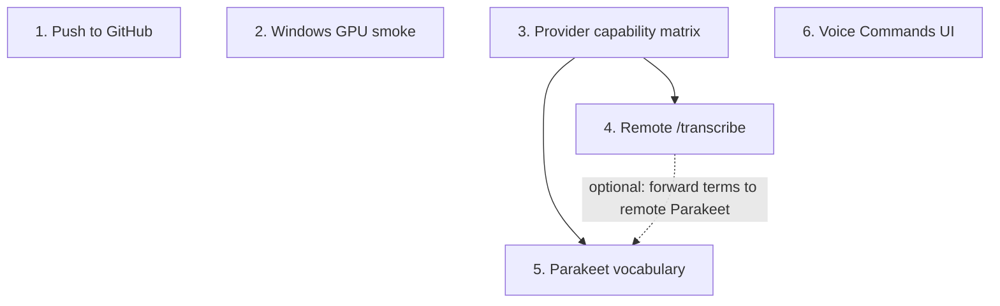

# VoiceTypr V2 — Deferred Items Execution Plan

- **Date:** 2026-06-07
- **Branch:** `plan/v2-roadmap`
- **Status:** V2 functionally ready and committed (`fc28741`). This plan covers the six post-V2 deferred items. None are current shippability blockers for macOS.
- **Guiding bias:** Simple-first. No frameworks, no settings sync, no streaming. Remote stays "Remote Control Lite": main device = brain/control plane, remote device = stateless CPU compute worker that never persists Personal Library, keys, snippets, app rules, or formatting settings.
- **Backward-compatibility scope (grounded):** The *app* shipped `v1.0.0`–`v1.12.8` with a live updater, but `src-tauri/src/remote/` and `src-tauri/src/writing.rs` are absent from `v1.12.8` and `origin/main` — remote transcription and the V2 writing pipeline have **never shipped**. Therefore:
  - **No legacy remote protocol compat.** There is no installed base speaking an old `/transcribe` protocol. The first release that includes remote *defines* the baseline. Do **not** maintain a "legacy raw v1" path; ship one current protocol plus a minimal version/capability field purely as future-proofing for post-launch device update-skew.
  - **No legacy compat for writing/app-rules/Parakeet-vocab/voice-commands.** All new; `#[serde(default)]` is sane initial values, not migration.
  - **The one real compat surface = the on-disk `settings` store.** Existing `v1.12.8` users will auto-update into V2 and their store (e.g. `enhancement_options` with old preset strings, AI settings, models, language) must load without crashing or silent misbehavior. Keep `migrate_preset_str` and serde defaults. This is "don't brick existing installs," not speculative versioning.

## Items at a glance

| # | Item | Priority | Depends on | Can verify here? |
|---|------|----------|------------|------------------|
| 1 | Push branch to GitHub | P0 | user go | yes |
| 2 | Windows GPU smoke test | P0 | Windows hardware/runner | partial (CI), no (driver) |
| 3 | Provider capability matrix | P1 | — | yes |
| 4 | Remote `/transcribe` + capability negotiation | P1 | #3 | yes |
| 5 | Parakeet/FluidAudio vocabulary wiring | P1 | #3, CTC models | partial (mac), hardware for accuracy |
| 6 | Voice Commands user surface | P2 | — | yes |

## Dependency graph

`1`, `2`, and `6` are independent. `3` is the only true prerequisite — it unlocks the *code shape* of `4` and `5` (shared capability truth instead of scattered per-callsite assumptions).

---

## P0 — Release safety before new architecture

### 1. Push branch to GitHub
- **Scope:** No code. On explicit user go, push `plan/v2-roadmap` to `origin`; open/update PR if desired.
- **Acceptance:** Remote branch contains current local commits. No force-push unless separately authorized.
- **Non-goals:** No release tag, no version bump, no drive-by CI changes unless CI actually fails.

### 2. Windows GPU smoke test
- **Scope:** Verify the packaged Windows x64 app on real Windows hardware/runner: GPU (Vulkan sidecar) path, CPU fallback, updater artifact/signature.
- **Key files:** `.github/workflows/release.yml` (Windows job), `scripts/release-windows.ps1`, `src-tauri/build.rs` (x64 sidecar TARGET gate), `src-tauri/windows/assert-no-vulkan-import.ps1`, `src-tauri/tauri.windows.conf.json`, `src-tauri/windows/installer-hooks.nsh`.
- **Acceptance:**
  - `workflow_dispatch` build produces `VoiceTypr_<version>_x64-setup.exe` + `.sig`.
  - `assert-no-vulkan-import.ps1` passes on `voicetypr.exe` (main process is CPU-safe, no `vulkan-1.dll` import).
  - Installs cleanly; launches without requiring `vulkan-1.dll` for the main process.
  - Acceleration `cpu`: known WAV transcribes, logs show CPU path.
  - Acceleration `auto` on Vulkan GPU: first transcription uses `whisper-vulkan-sidecar.exe`; sidecar failure falls back to CPU without crashing.
  - Kill/rename sidecar or no Vulkan runtime: still transcribes via CPU, surfaces a useful GPU-unavailable state (not fatal startup).
  - Updater accepts signature; `latest.json` uses `windows-x86_64` with matching URL/signature.
- **Add to CI (cheap, do now):** assert NSIS output bundles `whisper-vulkan-sidecar-x86_64-pc-windows-msvc.exe`, `vc_redist.x64.exe`, `VulkanRT-Installer.exe`; optional `whisper-vulkan-sidecar.exe --help` startup smoke.
- **Hardware-only (cannot be CI'd):** real Vulkan throughput/path selection, installer behavior around Vulkan runtime presence/absence, GPU-failure fallback under real drivers, end-to-end signed updater install.
- **Non-goals:** No GPU-over-network, no Windows ARM64 Vulkan, no perf benchmarking gate.

---

## P1 — Small shared capability layer, then remote/vocab

### 3. Provider capability matrix (do first in P1)
- **Why first:** lowest-cost way to stop duplicating provider assumptions across remote status, context compilers, and Parakeet vocab.
- **Shape (static rows + dynamic overlay, no framework):**
  - Module: `src-tauri/src/transcription/capabilities.rs` (engine behavior, not UI metadata).
  - Static rows keyed by engine (`whisper`, `soniox`, `parakeet`, `remote`):
    `ProviderCapabilities { shareable_remote, supports_initial_prompt, supports_structured_terms, supports_term_aliases, supports_corrections_as_terms, supports_translate_task, accepts_request_context, context_max_bytes }`.
  - Dynamic overlay: `RuntimeCapabilities { parakeet_ctc_vocabulary_available, remote_protocol_versions, remote_request_context }` layered over the static row. Remote rows derive from advertised status, not a static provider.
  - **Do NOT encode:** display names/colors/setup URLs, model catalog, formatting-LLM (OpenAI/Anthropic/Gemini) capabilities, prompt templates, settings-sync concepts.
- **Scope:** Move capability *facts* out of callsites; `writing.rs` keeps the actual compilers but derives its target from capabilities instead of owning provider truth. Replace hardcoded checks (e.g. "Soniox not shareable") with matrix lookups. One helper: `capabilities_for_shared_engine(engine, runtime)`.
- **Key files:** new `transcription/capabilities.rs` (+ `mod`), `commands/remote.rs::resolve_shareable_model_config`, `remote/transcription.rs` (`SharedServerState`/`RealTranscriptionContext`), `remote/http.rs::handle_status`, `commands/audio.rs` (`compile_whisper_initial_prompt`, `soniox_transcribe_async`, remote request build), `writing.rs` (`ProviderContextTarget`, `compile_context_for_target`, `compile_soniox_context`).
- **Acceptance:** unit test pins current truth (Whisper: initial-prompt + translate + shareable; Soniox: structured terms, not shareable, no translate; Parakeet: shareable, vocab false without dynamic CTC; Remote: derived from advertised caps). **No behavior change from introducing the table.** No new dependency/registry.
- **Non-goals:** no plugin system, no provider framework, no UI redesign, no new discovery.

### 4. Remote `/transcribe` + capability negotiation
- **Sequence:** after #3. **Single current protocol** — remote never shipped, so there is no legacy `/transcribe` to preserve (see Backward-compatibility scope). Do not build a v1/v2 dual path.
- **Design (one baseline, future-proofed):**
  - **One transcribe endpoint** carrying audio + *optional* structured context as `multipart/form-data`: `audio` part = raw WAV bytes; `metadata` part = JSON. (No base64-in-JSON — avoids ~33% bloat + copies.) No separate "legacy raw" route to maintain.
  - **Status:** `GET /api/v1/status` advertises `protocol_version`, `engine`, and `capabilities { transcription_tasks, request_context { terms, aliases, corrections, max_bytes }, acceleration:["cpu"], model_control }`. This negotiation earns its keep only *after* first ship (auto-update can desync two of a user's own devices); at launch both ends are the same build.
  - **Metadata:** `{ protocol_version, spoken_language?, transcription_task, context: { terms:[{text, aliases?}], corrections?:[{from,to}] } }`.
  - **Privacy boundary:** client sends only the subset the peer advertises *and* the provider can use. Never send snippets/Text Shortcuts, app rules, AI settings/keys, full `WritingSettings`, or Personal Library persistence metadata. Server holds context request-local only: no store writes, no status echo, no term values in logs.
  - **Forward-compat gate:** client tolerates a peer that doesn't advertise capabilities (a future *older* build) ⇒ send audio only, still transcribe. Context over `max_bytes` ⇒ deterministic prune (terms first, existing order, never split UTF-8); still too large ⇒ omit context, still transcribe. Remote is CPU-only — advertise `acceleration:["cpu"]`, no GPU flag.
- **Scope:** serde-defaulted optional capability fields on `StatusResponse`; `TranscribeMetadata` + `RemoteRequestContext` + strict-limit multipart parser; `ServerContext::transcribe` accepts optional request context; `RemoteServerConnection` posts multipart; optional safe `capabilities` cache on `SavedConnection` (optimization only); compile Personal Library context on the main device at request time.
- **Key files:** `remote/server.rs::StatusResponse` (+ DTOs), `remote/http.rs` (status + transcribe handler), `remote/client.rs` (`RemoteServerConnection`, `TranscriptionRequest`, `transcribe_audio`, `test_connection`), `remote/settings.rs::SavedConnection`, `commands/remote.rs` (status/update), `commands/audio.rs` (remote live/upload builders), `writing.rs` (remote-safe context compiler).
- **Acceptance:**
  - Server transcribes a request with no metadata part (context-less) and one with a metadata part.
  - Client → peer advertising no `request_context`: sends audio only, zero Personal Library context.
  - Client → peer advertising `request_context:true`: multipart with audio binary part + metadata JSON.
  - Oversized metadata rejected (413/400) before transcription.
  - Server uses context only where engine capability allows; otherwise ignores and still transcribes.
  - No logs/status/store serialize received Personal Library terms.
  - Translate task only sent/advertised where actually supported.
- **Non-goals:** no legacy-protocol path, no settings sync, no streaming/chunking, no cloud relay/accounts, no remote persistence, no GPU-over-network, no snippets/style/app-rules over remote.

### 5. Parakeet/FluidAudio vocabulary wiring
- **Sequence:** after #3; may land after or alongside #4 once the `terms` DTO is settled.
- **Design:**
  - Rust sends `custom_vocabulary: [{text, aliases?}]` on Parakeet transcribe **only** when matrix + sidecar status report availability.
  - Source: Words & Names first (`CustomWord.phrase` → `text`, `spoken_form` → alias). Corrections only if product explicitly wants them as `to` + `from` alias. Never snippets.
  - Sidecar `status` returns `capabilities.customVocabulary = CtcModels.modelsExist(...ctc110m)`. **No auto-download** of CTC models during transcription.
  - Fallback: no CTC models / no token timings / load/rescore error / empty vocab ⇒ current TDT path unchanged.
  - Application: after `AsrManager.transcribe` → use `tokenTimings`, load/cache `CtcModels`, build `CustomVocabularyContext`, run `CtcKeywordSpotter` + `VocabularyRescorer.ctcTokenRescore`, return rescored text only when modified.
- **Key files:** `parakeet/messages.rs::ParakeetCommand::Transcribe`, `parakeet/manager.rs::transcribe`, `commands/audio.rs` (local Parakeet callsite), `remote/transcription.rs::transcribe_with_parakeet` (only if remote forwards context), `sidecar/parakeet-swift/Sources/main.swift` (`StatusResponse`, `runEventLoop`, `transcribeFile`). FluidAudio APIs: `CustomVocabularyTerm`, `CustomVocabularyContext`, `CtcModels`, `CtcKeywordSpotter`, `VocabularyRescorer`.
- **Acceptance:** CTC absent ⇒ transcribes exactly as today, one concise log, no user-facing failure. CTC present + terms ⇒ transcript + optional applied-terms metadata (Rust tolerates absence). Terms language-scoped, disabled entries excluded, aliases sent only as aliases (no fuzzy engine in Rust), no snippets/style/app-rules/keys to sidecar. Unit tests for Rust command shape + Swift decode with/without `custom_vocabulary`. Hardware test: one sample where a known term improves, one where nothing should change.
- **Non-goals:** no CTC download UI this slice, no fuzzy matching in Rust, no snippets-as-vocab, no streaming bias, no support claims when CTC files missing.

---

## P2 — User-facing command editing

### 6. Voice Commands user surface
- **Decision:** minimal editable *deterministic* commands, post-V2. Built-ins already work; if schedule is tight, keep built-ins only and ship this later. Do **not** build a macro/action system.
- **Shape:**
  - Rust: `voice_commands: Vec<VoiceCommandRule>` on `WritingSettings` with `#[serde(default = "default_voice_commands")]` (existing settings get built-ins; empty list disables all). Rule: `{ phrase, output, language?, enabled }`.
  - Output constrained to punctuation/breaks only (comma, period, question/exclamation mark, colon, semicolon, dash, newline, paragraph). Arbitrary text insertion stays in Text Shortcuts.
  - Language: default English scope, per-rule.
  - Pipeline: replace `VOICE_COMMANDS_EN` const usage with sanitized settings-backed definitions; preserve protected spans + operation provenance.
  - TS: `VoiceCommandRule` + `voice_commands` in `src/types/writing.ts` defaults/merge.
- **Key files:** `writing.rs` (`WritingSettings`, `sanitize_writing_settings`, `apply_voice_command_stage`, `collect_voice_command_candidates`), `src/types/writing.ts`, `src/components/EnhancementSettings.tsx`, `EnhancementsSection.tsx` tests, `commands/ai.rs` (`get/update_writing_settings`).
- **Acceptance:** legacy users (no `voice_commands`) keep current behavior; edited list changes deterministic post-processing without AI; disabled/language-mismatched commands don't apply; commands don't apply inside protected spans; invalid outputs/empty phrases sanitized out; FE tests cover add/edit/disable/delete + rollback on save failure.
- **Non-goals:** no user hotkeys/macros, no app launching/paste/automation, no AI interpretation, no remote sync, no arbitrary text replacement here.

---

## Risks & traps

- **Matrix → framework.** Keep to behavior flags + byte limits. No traits/registries/provider objects.
- **Remote v2 → settings sync.** Only request-local `terms`/`aliases`/optional `corrections`. Never the full Personal Library object or any keys/rules.
- **Advertised caps drift from actual path.** Tests must assert status capabilities and handler behavior *together* per engine. Default `false` for anything not wired.
- **Base64 envelope temptation.** Use multipart binary + JSON metadata (one route/parser, not an abstraction).
- **Parakeet vocab silent failure.** Expose capability truth (vocab unavailable unless CTC files exist); fallback explicit in logs, non-fatal.
- **Corrections overreach into fuzzy replace.** Corrections-as-context = canonical term + alias only; deterministic post-STT replacement stage remains source of truth.
- **Voice Commands vs Text Shortcuts overlap.** Voice Commands = punctuation/breaks only.
- **Stale remote capability cache.** Cache is optimization only; on failed v2 / missing / old cache ⇒ fall back to v1/no-context; refresh caps on every status/test.
- **Windows CI proves packaging, not drivers.** Mark GPU path release-ready only after real-hardware transcription + CPU-fallback smoke.

## Simple-now, extend-later cuts

- Capability negotiation = extend `/api/v1/status`; no new discovery protocol.
- Add only `/api/v2/transcribe` multipart; no streaming/chunk/resumable upload.
- Remote advertises `acceleration:["cpu"]` only; remote GPU is a separate future product decision.
- Parakeet vocab = optional CTC-rescore post-pass when local CTC files exist; no downloader/UI in the first slice.
- Voice Commands = punctuation/break-only; no macro system.
- `SavedConnection` persists only safe capability hints, never remote Personal Library data.
